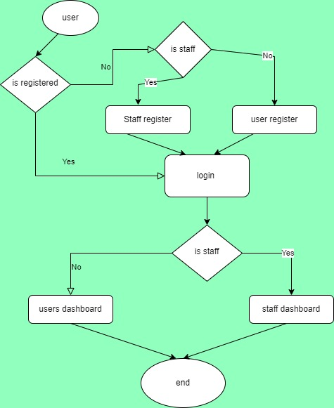

# django-auth-system

This project involves multi-user authentication
and authorization using django

The Project is done collaboratively by
1. Noel K Langat (noellangat28@gmial.com)
2. Ezekiah Koeck  (hezekiahkoech@gmail.com)

**Here is the design**

Send us message to collaborate on this project
